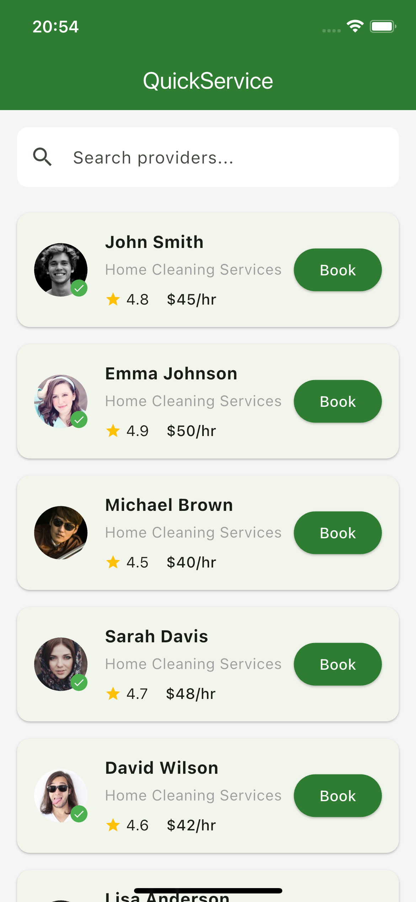
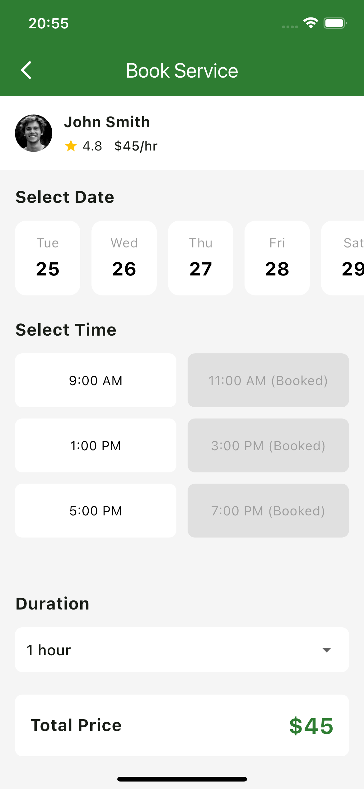
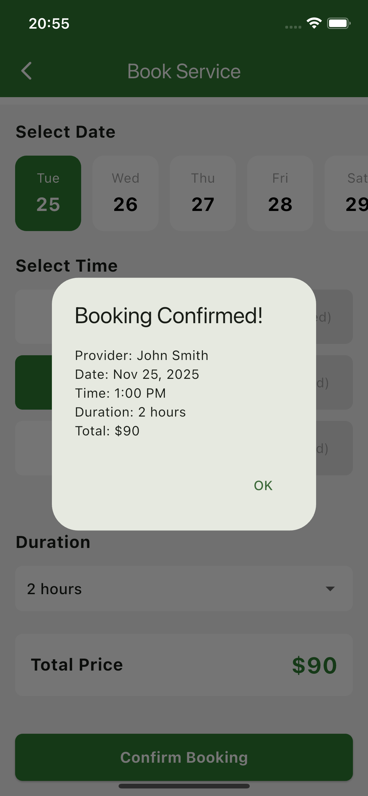

# quick_service

A simple home cleaning service booking application built with Flutter.

# Time Spent
Approximately 2 hours

# State Management Approach
I used the Provider package for state management because it's simple and easy to understand for beginners. The BookingState class holds all the booking information (selected date, time, and duration) and uses notifyListeners() to update the UI whenever something changes. It's like having a shopping cart that remembers your selections and automatically updates the screen when you add or remove items.

-- Install Dependencies
```bash
flutter pub get
```
-- Run the App
```bash
flutter run
```

## Project Architecture
```
lib/
├── main.dart                          # App entry point
├── models/
│   ├── provider_model.dart            # Card provider data model
│   └── booking_state.dart             # Booking state management
├── screens/
│   ├── provider_list_screen.dart      # Home screen with provider list
│   └── booking_screen.dart            # Booking screen
└── widgets/
    └── provider_card.dart   
    └── loading_shimmer.dart           # Loading shimmer widget
```

## Screenshots

### image one


### image two


### image three



